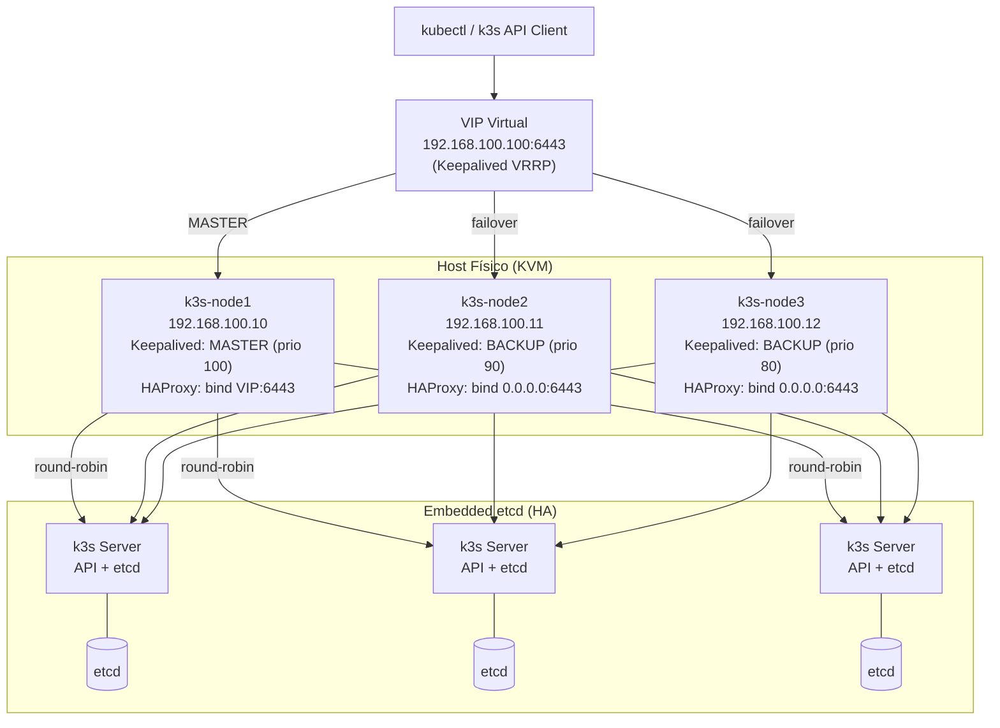
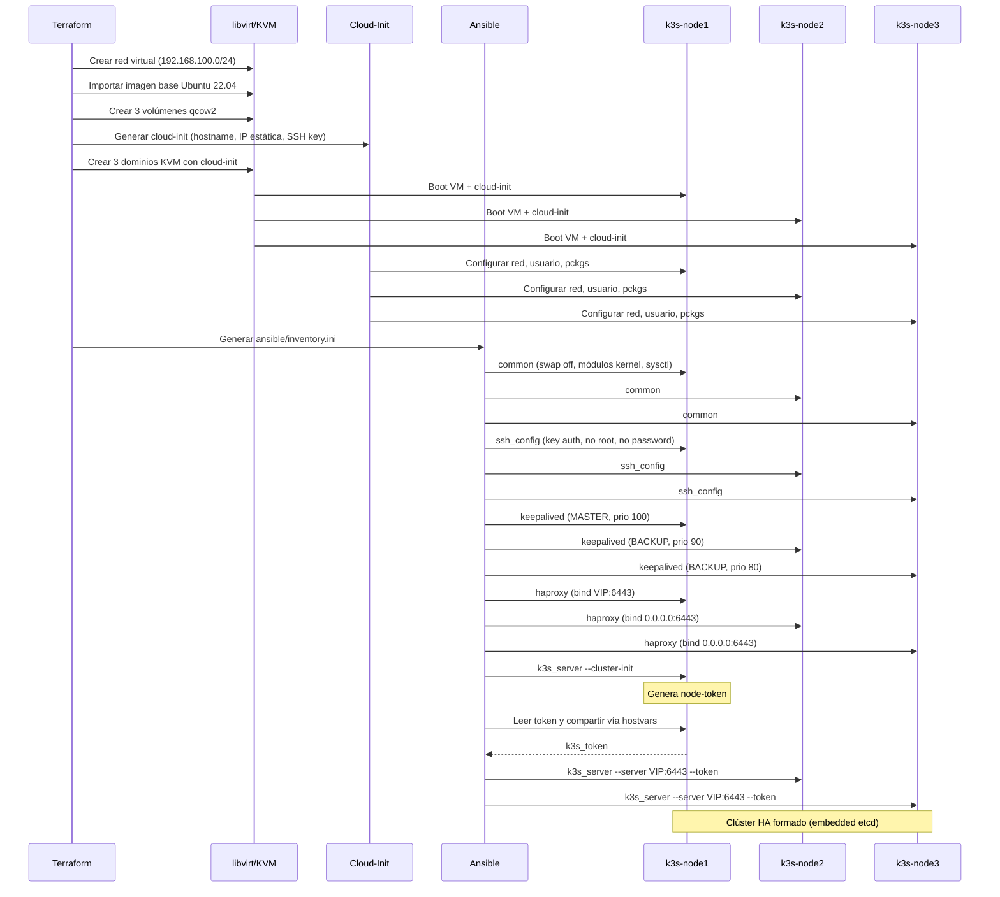

# k3s High Availability Cluster

Implementación automatizada de un clúster **k3s en alta disponibilidad (HA)** sobre máquinas virtuales **libvirt/KVM** usando **Terraform** y **Ansible**, diseñada expresamente para **medir el consumo energético de Kubernetes en recursos limitados** al ejecutar una aplicación bajo estrés, sin interferencia de la capa de virtualización de red.

## Arquitectura



### Flujo de despliegue



## Diseño de red

La red virtual libvirt se configura en **modo route** (no NAT). Esto es intencional: el objetivo principal de esta implementación es **medir el consumo energético de Kubernetes** al ejecutar una aplicación bajo estrés. Una red en modo NAT agregaría procesamiento adicional de traducción de direcciones (SNAT/DNAT) en cada paquete, introduciendo ruido en las mediciones de potencia. Con modo route, el host enruta los paquetes sin modificarlos, aislando el overhead de red y asegurando que las lecturas de consumo reflejen únicamente la carga del clúster k3s y la aplicación, no la virtualización de red.

La conectividad a internet para las VMs es opcional y se habilita bajo demanda con `nat_on.sh`, exclusivamente para tareas que lo requieran (como descargar imágenes o paquetes), sin permanecer activa durante las pruebas de energía.

## Prerrequisitos

| Requisito | Versión |
|---|---|
| Linux con KVM/libvirt | cualquiera con `virsh` funcional |
| Terraform | >= 1.0 |
| Ansible | >= 2.9 |
| Imagen cloud Ubuntu 22.04 | `jammy-server-cloudimg-amd64.img` |
| Python + `python3-pip` | para `pylibvirt` si es necesario |

## Estructura del proyecto

```
k3sHA/
├── ansible/
│   ├── ansible.cfg          # Configuración global de Ansible
│   ├── playbook.yml          # Playbook principal (2 plays)
│   └── roles/
│       ├── common/           # Swap off, kernel modules, sysctl
│       ├── haproxy/          # HAProxy TCP load balancer
│       ├── keepalived/       # Keepalived VRRP + VIP
│       ├── k3s_server/       # Instalación k3s HA (embedded etcd)
│       └── ssh_config/       # Hardening de SSH
├── terraform/
│   ├── config/
│   │   ├── cloud-init.cfg    # Template user-data (Jinja2)
│   │   └── network-config.cfg # Template netplan (Jinja2)
│   ├── main.tf               # Recursos libvirt + inventario
│   ├── provider.tf           # Provider libvirt
│   ├── terraform.tf          # Versiones y providers
│   ├── variables.tf          # Variables con defaults
│   └── limpia.sh             # Destrucción total
├── nat_on.sh                 # Activar NAT para VMs
├── nat_off.sh                # Desactivar NAT para VMs
├── limpia_fingerprint.sh     # Limpiar known_hosts y test SSH
└── .gitignore
```

> **Nota:** `ansible/inventory.ini` es generado automáticamente por Terraform. Las claves SSH deben generarse localmente (ver instalación).

## Instalación

### 1. Clonar el repositorio

```bash
git clone <tu-repo-url>
cd k3sHA
```

### 2. Generar claves SSH

```bash
ssh-keygen -t ed25519 -f keys/key -N ""
```

### 3. Crear archivo de variables locales (no se sube a git)

Las variables `base_image` y `cluster_user` no tienen valor por defecto. Crea `terraform/terraform.tfvars` (está en `.gitignore`):

```hcl
base_image   = "/ruta/a/jammy-server-cloudimg-amd64.img"
cluster_user = "jdelpino"
```

### 4. Preparar imagen base

```bash
wget https://cloud-images.ubuntu.com/jammy/current/jammy-server-cloudimg-amd64.img
```

### 5. Crear infraestructura con Terraform

```bash
cd terraform
terraform init
terraform apply -auto-approve
cd ..
```

Esto crea:
- Red libvirt `k3s-tesis` (192.168.100.0/24, modo route)
- 3 VMs (k3s-node1, k3s-node2, k3s-node3) con IPs estáticas
- Cloud-init configurando hostname, usuario del clúster y llave SSH
- Archivo `ansible/inventory.ini` con variables de keepalived, haproxy y usuario

### 6. Habilitar NAT (opcional, para internet en VMs)

```bash
./nat_on.sh
```

### 7. Limpiar fingerprints y probar conectividad

```bash
./limpia_fingerprint.sh
```

### 8. Ejecutar Ansible

```bash
cd ansible
ansible-playbook playbook.yml
```

Este playbook:
1. **Nodo 1:** Aplica common → ssh_config → keepalived (MASTER) → haproxy (bind VIP) → k3s (--cluster-init)
2. **Nodos 2 y 3:** Aplica common → ssh_config → keepalived (BACKUP) → haproxy (bind 0.0.0.0) → k3s (--server VIP:6443)

### 9. Verificar el clúster

```bash
ssh -i keys/key jdelpino@192.168.100.10
kubectl get nodes -o wide
kubectl get pods -A
```

## Componentes

### Terraform

Crea toda la infraestructura en libvirt:

| Recurso | Descripción |
|---|---|
| `libvirt_network` | Red virtual en modo route (sin NAT), DHCP desactivado — evita overhead de traducción de red que contaminaría las mediciones energéticas |
| `libvirt_volume.base_image` | Imagen base importada |
| `libvirt_volume.vm_disk` | 3 discos qcow2 de 20 GB |
| `libvirt_cloudinit_disk` | ISOs cloud-init con IP estática y SSH key |
| `libvirt_domain` | 3 VMs con 3 GB RAM, 2 vCPUs |
| `local_file` | Genera `ansible/inventory.ini` |

### Ansible roles

| Rol | Función |
|---|---|
| **common** | `swapoff`, carga `overlay`/`br_netfilter`, sysctl para K8s |
| **ssh_config** | Solo key auth, deshabilita root login, despliega llave pública |
| **keepalived** | Instala y configura VRRP con VIP `192.168.100.100` |
| **haproxy** | Balanceo TCP round-robin en puerto 6443 hacia los 3 nodos |
| **k3s_server** | Instala k3s con embedded etcd; nodo1 inicia, nodos 2-3 se unen |

### Alta disponibilidad

- **Keepalived** monitorea HAProxy mediante `killall -0 haproxy`. Si HAProxy cae, la prioridad del nodo baja 2 puntos, provocando failover del VIP.
- **HAProxy** balancea en round-robin las conexiones a la API de k3s (puerto 6443) hacia los 3 servidores.
- **k3s** usa embedded etcd (3 nodos), tolerando la caída de 1 nodo.
- Si el nodo MASTER con el VIP falla, otro nodo toma el VIP y HAProxy sigue distribuyendo tráfico a todos los servidores k3s saludables.

### Scripts auxiliares

| Script | Función |
|---|---|
| `nat_on.sh` | Activa IP forwarding y NAT para que las VMs tengan salida a internet |
| `nat_off.sh` | Elimina la regla NAT |
| `limpia_fingerprint.sh` | Limpia `known_hosts`, carga SSH key y prueba ping/SSH/Ansible |
| `terraform/limpia.sh` | `terraform destroy` + limpia `.terraform/` y `tfstate` |

## Limpieza

```bash
# Destruir VMs y recursos
cd terraform && bash limpia.sh

# Desactivar NAT
cd .. && ./nat_off.sh
```

## Variables de Terraform

| Variable | Default | Descripción |
|---|---|---|
| `vm_count` | `3` | Número de nodos |
| `vm_memory` | `3072` | RAM por VM (MB) |
| `vm_cpu` | `2` | vCPUs por VM |
| `vm_disk_size` | `20` | Disco raíz (GB) |
| `base_image` | *(obligatorio)* | Ruta a imagen cloud Ubuntu 22.04 |
| `cluster_user` | *(obligatorio)* | Usuario administrativo del clúster |
| `ssh_public_key` | `keys/key.pub` | Llave pública SSH |
| `ssh_private_key` | `../keys/key` | Ruta llave privada SSH |
| `vip_address` | `192.168.100.100` | IP virtual keepalived |
| `vm_names` | `[k3s-node1, ...]` | Nombres de las VMs |
| `vm_ips` | `[192.168.100.10, ...]` | IPs estáticas |
